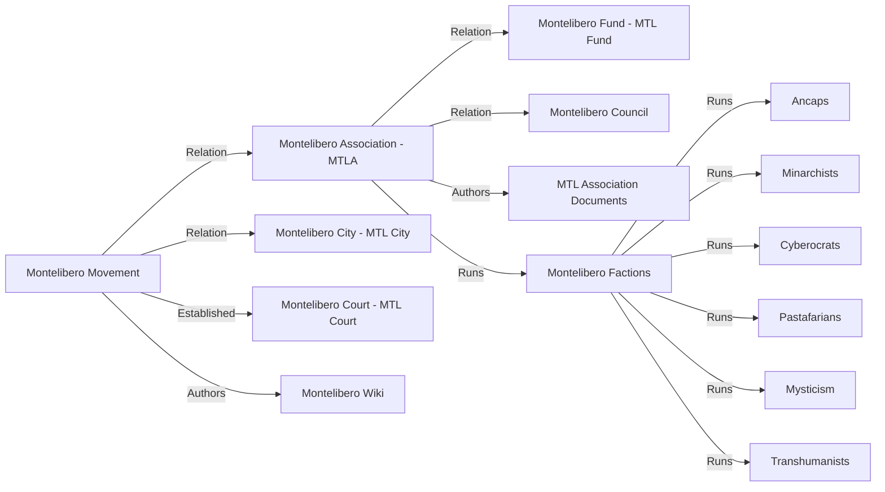
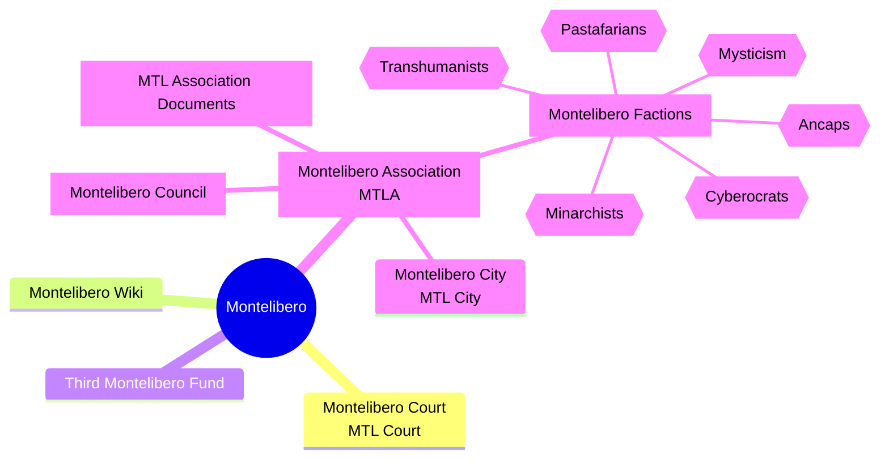

# Montelibero

```mermaid
graph LR
    E[Montelibero Movement] -- Relation --> A[Montelibero Association - MTLA]
    A -- Relation --> D[Montelibero Fund - MTL Fund]
    E -- Relation --> F[Montelibero City - MTL City]
    A -- Relation  --> B[Montelibero Council]
    E -- Established --> C[Montelibero Court - MTL Court]
    A -- Authors --> G[MTL Association Documents]
    E -- Authors --> H[Montelibero Wiki]
    A -- Runs --> I[Montelibero Factions]
    I -- Runs --> J[Ancaps]
    I -- Runs --> K[Minarchists]
    I -- Runs --> L[Cyberocrats]
    I -- Runs --> M[Pastafarians]
    I -- Runs --> N[Mysticism]
    I -- Runs --> O[Transhumanists]
```

```mermaid
mindmap
  root((Montelibero))
    Montelibero Court<br>MTL Court
    Montelibero Wiki
    Third Montelibero Fund
    id[Montelibero Association<br>MTLA]
      Montelibero City<br>MTL City
      id[Montelibero Council]
      id[MTL Association Documents]
      id[Montelibero Factions]
        id{{Ancaps}}
        id{{Minarchists}}
        id{{Cyberocrats}}
        id{{Pastafarians}}
        id{{Mysticism}}
        id{{Transhumanists}}
```
