# Montelibero

Mindmap of Montelibero to make it easier to see relationships between the various parts of the movement. This mindmap is not official and it doesn't show all and correct relationships, as there are cross-relationships between the various parts of the movement that are not shown here.

Naming convention and abbreviations used in this mindmap:

MTL: Montelibero  
MTLA: Montelibero Association

```mermaid
mindmap
  root(("`**Montelibero**`"))
    id[Montelibero Association]
        MTL City 🏘️
        id[MTLA: Assembly]
            id[MTLA: Council]
        id[MTLA: Agora 🪙]
        id[MTLA: Documents 📙]
        id[MTLA: Factions]
            id{{Ancaps 💛}}
            id{{Minarchists}}
            id{{Cyberocrats 😸}}
            id{{Pastafarians 👾}}
            id{{Mysticism}}
            id{{Transhumanists}}
    MTL Court ⚖️
    Montelibero Wiki 📃
    Third Montelibero Fund
    MTL Programmers
        MTL Solar Wallet
```

